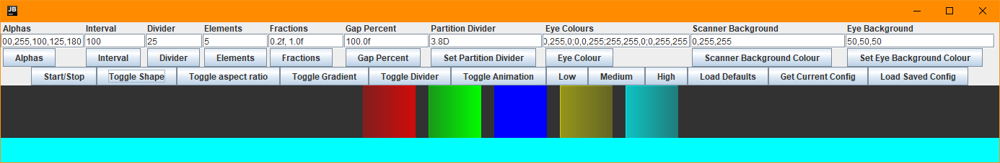

[](https://github.com/Griefed/LarsonScanner)

[![Homepage](https://img.shields.io/badge/Griefed.de-Homepage-c0ffee?style=for-the-badge&labelColor=325358&logo=data:image/png;base64,iVBORw0KGgoAAAANSUhEUgAAAEAAAABACAMAAACdt4HsAAACylBMVEUAAAD////////////////////////////////////////////////////////////////////////////////////////////////////////////////////////////////////////////////////////////////////////////////////////////////////////////////////////////////////////////////////////////////////////////////////////////////////////////////////////////////////////////////////////////////////////////////////////////////////////////////////////////////////////////////////////////////////////////////////9/f39/f39/f39/f39/f39/f39/f39/f39/f39/f39/f39/f39/f39/f39/f39/f39/f39/f39/f39/f39/f39/f39/f39/f39/f39/f39/f39/f39/f39/f39/f39/f39/f39/f39/f39/f39/f39/f3+/v7+/v7+/v7+/v7+/v7+/v7+/v7+/v7+/v7+/v7+/v7+/v7+/v7+/v7+/v7+/v7+/v7+/v7+/v7+/v7+/v7+/v7+/v7+/v7+/v7+/v7+/v7+/v7+/v7+/v7+/v7+/v7+/v7+/v7+/v7+/v7+/v7+/v7+/v7+/v7+/v7+/v7+/v7+/v7+/v7+/v7+/v7+/v7+/v7+/v7+/v7+/v7+/v7+/v7+/v7+/v7+/v7+/v7+/v7+/v7+/v7+/v7+/v7+/v7+/v7+/v7+/v7+/v7+/v7+/v7+/v7+/v7+/v7+/v7+/v7+/v7+/v7+/v7+/v7+/v7+/v7+/v6OsnIvAAAA7XRSTlMAAQIDBAUGBwgJCgsMDQ4PEBESExQVFhcYGRobHB0eHyAhIiQlJicoKSorLC0uLzAxMjU2Nzg5Ojs8Pj9AQUJERUZHSElLTE9QUVJTVFVWV1hZXF1eX2BhYmNkZWZnaGlqa2xtbm9wcXJzdHV2d3h5ent8fX5/gIGCg4SGh4iJiouMjY6PkJGSk5SVlpeYmZqbnJ2en6Cio6WmqKmqq6ytrrCxsrO0tba3uLm6u7y9vr/AwcLDxMXGx8jKy8zNzs/Q0dLT1NXW2Nrb3N3e3+Dh4uPk5ebn6Onq6+zt7u/w8fLz9PX29/j5+vv8/f4O/wLaAAAGUklEQVR42o3WBVsb2xoF4G9PQqgXubktUnd3d3fFqjjHQt2Vg9Xd3TXU3d1b3KEugczM+g8nY5VAmrxYZGaxtj1A9jgfcoS1SdKTUx73gg2kYZzOTcdIYQjKeVWZnPJ7a91bh2zc6/SJWbNj16F9G+aNa12VkXGjBYU+5FTTz0DqmPphB9MsIjRCgXnRXRH42pSc6lQCgLdCIYoifsL3IqcG8FB8e34sISpkUnjUjKRj2VpeIDmjmweFdYeRkcr/mtYjK9CNfstnt1pAyFxmJA3XIi5VUDucqEeOsV5p6u2v5tbl6Cecb9RtC2T5Qxk5wE35rN5u8uPKhHuMPPZB/FgClEzXUbl0s3jg6S3+Ubgnlati1w1XB74ExPhyJ4KbzQNHasQHVyeHdH56nxQpoZwOLIyHuLkC6ciJSrtEiNMZ2ev3BdjgTi6ouAsoGUJ2amUCh9zJJZVSgHy71XQ7CDzwJhf5vQRO/DqR4wR87qYn1+gS7gHi0gGdmvp5cKSv4tOsd1A68PaaH7loAg8bvuTz23s+lPS66BsvAhDX66rWlDlt4vEYitIgojbZULzvwqSH/OOPy8iZCBGyPQYiFmSB7GgFBpuNNPrtWfOZW2bzlcvmlFtnzGdvms3XLppTbqeYz18/15YkXq8heVObbAwb5DjLCJID4qjfmTBDyNTuxpi/vHtOCTGEhrarE/FX1cGTR1eMiuxxsTVJYgWp7GiSGe/A5rYHMVy68eGU35wddXc3o/EJ7u4rxlKLXXVYxHx91Y0DqNv2/7E5C5QOflIFoSkpZktPIhkxPMzNB7AzpHdYjcjh3XsOifl/aO+QOlPHtRs84E/vqL6jmwZP6HFO6sDNlyr8STJ2GECqLxHDLTmgcINpxZNZplPHTbOeJps23ZlhOn/AtOD5UtOua7GxZxMfMCKql8UDpxhJKmdCFOI4Iia+KCoGYO5rZ/qGn591Ihtu+V4euVVJ0qwUqZdakM3UE6mb41Lj2pOdfn9TGcYa6bC2JMkwEfv8dSQJmBDtYSZyJYDYGWAUSf4BlpAiIMJ/4R0XA2g1MJMkiUCUFrCs34bnrgaYgLVyle0QA7SAwMAGZlcDJgC75YC9EMdqAXcXBDxyNWA8cJBsdCeBUC1gZijnuIFnTVVFkgQAR8iGOwxEawHjfUPPkL1mJ+/0JKKW36C6TpIQYA9JtgLztYB1AcnvyE717LeFX5sT9YMmlyR/qZNIC4Et3xs0DCjToGeSu25KZNmARO0XBwKXOTVgaQAzk53aNYn07ewDdLWOAQEkac8jx9+oBFyOL2cVmPxJjd6LqtPSjFzOBt9emdwi8IeXccoQRraxazDYpAqqvnqnagoRFy8ARZ4k4S4AQmY9ZRlbL3hFP2Ol0ERDk0PklwbgPEeymQCEeZwUMKNt/INfA/DdPz/NAYsW8OMItRYBvPKTAoKm+JpdCfC4A5s7RpKNldKEWCng2Sy7SWQiNFHQZNAoC2zE9QayqZMKyStPooA/ovVyA6Yh0w5VfOWl2sNhFY9DZglkRIZ9kAnh0ip4RF8gonioSgc9hKpggADVo24foMhuQxRiheJxdWkrrywmohS7gds9zN8oAhD5r4WvEsnn3tvPJcofyxBbg7bDU5wHfLr2EcgO7NnUp7KeuOq+TTr2TxCB+/G6gFUjmAsBeUNKIQTSz9wvAGm1KeDE2vHSKqyHih/5GqqPnZ/nqi6mAUfc6BdN3gKXqgSMH9DNTETBO1RrqoZrDxdzpKpyGciuTXbGWYGDocv7xWcQUS40fQRompOi0gHg2wCyxy0EkBXhP/cWEeVD0w/ftSIbHVXeBwjRjMrQrxOBq9OMV3SOAzwmJPifBwR1OHbc1wJIH5q2sWvFcofQwivyCX/3NSAu0VO59AutgNUifji2f+O/cbL5VYLiFPHJM16LkFj+5sgBbtxbyCx3on79f52rP/+12iVvMCPHGp8TIRNS/22hI40xLku9XTxel37LMDUPCvGKP6k4n708FEvdyJlgEYqis2tmhE+dGDZr/dl0KxR8f3KqN49yCTyAkg7kVLNvgHh72YViAd9Z81JMLcakAp+bkFM+RbCsMxLn1Wnism1Hjh/YsSp2ZMtqjIjq7LW+9SWnqrzODjCQijFGPxiC71Ynp/RJrZnjehzZ+Q9fNggLmTcf8AAAAABJRU5ErkJggg==)](https://www.griefed.de)
[](https://www.griefed.de/blog)
[![Fleet](https://img.shields.io/badge/Griefed.de-Fleet-c0ffee?style=for-the-badge&labelColor=325358&logo=data:image/png;base64,iVBORw0KGgoAAAANSUhEUgAAACAAAAAgCAMAAABEpIrGAAABiVBMVEUAAAD///////////////////////////////////////////////////////////////////////////////////////////////////////////////////////////////////////////////////////////////////////////////////////////////////////////////////////////////////////////////////////////////////////////////////////////////////////////////////////////////////////////////////////////////////////////////////////////////////////////////////////////////////////////////////////////////////////////////////////////////////////////////////////////////8XJWL///8gNCTuAAAAgXRSTlMAAgMEBQYHCAkLDA4PEBESFhgZGh0eISIlKC8zNDU3OT0+P0BBQkhKS01QU1RVVltcXWJjZGlrbG1wcnN0eHl6e4CBhYyOkJWWmZ6foaKkqaqsrrKztLe8vsHExcbHy8zNz9DT1NXX2Nna293e3+Tm5+nq7O3u7/Hy9fb4+fr7/f4zgtRAAAABWklEQVR42mKgHhCFMbg0dHW1xNGlBcw5wTS7tkcJoNV5UJItBoMA3GPjcm3btm3btq1+8s1JxijuV0p+X5NzVcfNRoT4O26ClEZykdydI5ddCHDt+EfqthiwYoXfRH++yb9r8IZ+o/CpeB1hE/zMtXf0KYKkP9p8ZSaCfq1S2ddDU84zrsuXYXZjYy0VcBxQKYVmgQ9slS8HhUbxSP+kNAPB+kIyO1ggr5mn9GoX70wKydA4/RNQQSVPvGspZEHQ5ZKHK5lu8UymUi/enRQuxYjcN5LPH+RTQfcVlQ4AbfJ1n4JKRusG0ErpzCn3vjFMe8g9/eUU2himHEAilc+Vq6XJ4Zyx6eXTk3f6/IOww7i2oOliXNXQ/H5kHBcWSO2MowyKJc4VU/BLOGcMm04EJF3FyHsQImkvMj/tQBhrz0to+rwSUf70XvjT23VWxKLLaBkYGuqr+Y8f9Q3q0fzzGED8cgAAAABJRU5ErkJggg==)](https://fleet.griefed.de)
[](https://github.com/Griefed)
[](https://hub.docker.com/u/griefed)
[](https://discord.griefed.de)

---

# Sources, GitHub, GitLab and Mirroring and all that good stuff

Repositories on GitHub are now for issues only. I've set up my own installation of GitLab and moved all my repositories over to [Git.Griefed.de](https://git.griefed.de/users/Griefed/projects). Make sure to check there first for the latest code before opening an issue on GitHub.

For questions, you can always join my [Discord server](https://discord.griefed.de) and talk to me there.

---

# LarsonScanner

[](https://github.com/Griefed/LarsonScanner)
[](https://github.com/Griefed/LarsonScanner)

This is a [Larson Scanner](https://wiki.evilmadscientist.com/Larson_Scanner#:~:text=The%20Larson%20Scanner%20is%20named,of%20the%201970s%20and%2080s.) inspired by the Cylons from Battlestart Galactica and Kitt from Knight Rider.
It's basically just a red light which scrolls from left to right to left, with a nice fade-out effect along with it.

This Larson Scanner lets you customize just about everything though! To get an idea about what's possible with this Larson Scanner, make sure to take a look at the examples below!


---

# Implementation

`$VERSION` is the version of LarsonScanner you want to use in you project.

LarsonScanner was written using Java 8.

## Using Gradle

```groovy
implementation 'de.griefed:larsonscanner:$VERSION'
```

## Using Maven

```xml
<dependency>
  <groupId>de.griefed</groupId>
  <artifactId>larsonscanner</artifactId>
  <version>$VERSION</version>
</dependency>
```

## Usage

The quickest way is to create a new instance of LarsonScanner with the default values and just add
it the the element you want to display it in.
```java
LarsonScanner larsonScanner = new LarsonScanner();

JFrame frame = new JFrame();
frame.setDefaultCloseOperation(JFrame.EXIT_ON_CLOSE);
frame.setPreferredSize(new Dimension(width, 182));
frame.setSize(new Dimension(width, 182));
frame.add(larsonScanner);
frame.setLocationRelativeTo(null);
frame.pack();
frame.setVisible(true);

larsonScanner.play();
```

LarsonScanner comes as a `JPanel`, so you can immediately add it to your Java Swing GUI.

# Examples

The GIF shown just above the **Implementation**-chapter shows the default settings to which you can compare all the following examples to.

## Alpha Values

You can set the alpha value for each element in the eye separately, allowing you to create some neat effects!

**Be aware** that these alpha values are **only** used when you use gradients!
Alpha values are reset / automatically set / calculated when you change the number of
elements in your configuration. So, if you plan on using custom alpha values and a custom
amount of elements, make sure to update your alphas after changing the number of elements!

### 255,200,100,100,150 (default 100,200,255,200,100)


## Interval

Every <code>n</code> milliseconds the position of the eye gets updated and the eye redrawn. Smaller values therefor
increase the speed at wich the eye scrolls across the screen, whilst bigger values decrease it.

### 25ms (default 100ms)


## Divider

The divider determines the amount with which to increment or decrement the position of the eye each
time the timer fires. Meaning: Smaller values increase the speed of the eye whilst bigger values decrease it.

### 5 (default 25)


## Number of elements

The number of elements in the eye of the Larson Scanner. Pretty self-explanatory.

### 21 (default 5)


## Fractions

Fractions for the distribution of colours along the gradients of each oval-shaped element.

### 0.1f, 0.7f (default 0.4f, 1.0f)


## Gap divider

The gap between rectangular elements is <code>n %</code> of the width of one element. Meaning:
A smaller divider results in smaller gaps, whilst a bigger divider results in larger gaps.

### 100.0f (default 25.0f)


## Partitioning

The total width of the available area is divided by this value, and the resulting value is the total width of the
eye in which all elements will be drawn. The smaller the value, the bigger the eye and the other way around.

### 15.0D (default 5.0D)


## Aspect ratio enforcing

If the aspect ratio is being forced, each element will be drawn with a 1:1 aspect ratio, turning ovals
into circles and rectangles into squares. The aspect ratio is being enforced by de-/increasing the
height of the eye in the scanner to the width of one element, resulting in a nice and sexy 1:1 ratio.

If you plan on using different scanner and eye background colours, you should make use of this setting,
otherwise the eye background colour will also prevail.

### true (default false)


## Animation styles

You can choose between a total of two different animation styles, Cylon-eye and Kitt-eye.
If you plan on using the Kitt-eye animation, say goodbye to the alpha-setting, as it will not have
any affect on the eye whatsoever when using the Kitt-style animation.

### Cylon eye (default)

#### Oval (default)


#### Rectangle


### Kitt eye

#### Oval


#### Rectangle


## Use gradients (default true)

Whether to draw the eye using gradients. If gradients are not used, then every element in the eye
will be drawn using a solid colour.


## Use divider (default true)

Whether to use a divider to in-/decrement across the width of the Larson Scanner. If the divider is
being used, then the position of the eye will be updated with the result of the width of the Scanner
divided by the divider.


## Eye colours

Set the colour for each element in the eye, from left to right. If you plan on using this, make sure
to check the number of elements in your eye beforehand! You **must** provide one colour per element.

### 255,0,0 - 0,255,0 - 0,0,255 - 255,255,0 - 0,255,255 (default 255,0,0 - 255,0,0 - 255,0,0 - 255,0,0 - 255,0,0)


## Scanner background colour

The background colour of the LarsonScanner JPanel in which the eye resides in. If you plan on using
this, then you are advised to use the aspect ratio enforcement, because otherwise the available area
will be filled with the background colour of the eye.

### 0,255,255 (default 0,0,0)


## Eye background colour

The background colour of the eye in the LarsonScanner.

### 255,0,255 (default 0,0,0)


## Quality settings

Changing the quality settings is only really relevant when you plan on making the LarsonScanner quite large.
For smaller scanners, you can leave these on low (default) and nobody will notice.

### Low (Default)


### Medium


### High


# Playground

If you want to experiment with this Larson Scanner, or find the perfect configuration for yourself, there's a class in the misc-folder in this repository, call `Playground.java`. It creates
a GUI for you which lets you play around with all the different settings, so you can see whether this is something for you, or so you can tweak some stuff around to find the perfect
settings for you and your project. Enjoy!

